# Dubai Real Estate Analysis & Modeling

## 1. Data collection

### Sales market

Our dataset consists of approximately **1 million transactions** from the **Dubai property sales market**, covering the period from **1997 to 2022**.  

We will analyze three main property types separately:  
- **Unit**  
- **Building**  
- **Land**  

Before conducting analytics and modeling, **data cleaning** is essential to ensure accuracy and reliability. Our data preparation process includes the following steps:  

- **Categorical Attribute Cleaning**:  
  - Standardizing values using a **dictionary-based renaming approach**.  
  - Grouping **uncommon categories** under an **"OTHER"** label.  
  - To analyze trends effectively, we compute the average target values within each category for the previous month, segmented separately for each real estate type.
    
- **Date Feature Processing**:  
  - Converting date attributes into structured formats.  
  - Generating new time-based features such as **year, quarter, and month**.  
  
- **Numerical Feature Transformation**:  
  - Refining numeric attributes and adding relevant flags.  
  - Ensuring accurate calculations by **dividing total amounts by the number of units** to determine the **true rental price per property type**.

### Rental market

Our dataset consists of approximately **5.5 million transactions** from the **Dubai rental market**, covering the period from **2010 to 2022**.  

We will analyze four main property types separately:  
- **Unit**  
- **Virtual Unit**  
- **Building** (includes **Villas**)  
- **Land**  

We will take the same steps to prepare data for the Rental market as for the Sales market.

### Additional Indicators for Real Estate Valuation  

Below, we present additional indicators that can serve as valuable factors in assessing real estate value.  

#### Consumer Price Index (CPI) Indicators

The figure below displays graphs of monthly CPI index indicators across different sectors.  
- On the left, absolute values are shown, while on the right, the year-over-year changes are depicted.  
- Notably, there was a sharp increase in the CPI index for **Tobacco in 2018** and **Transportation in 2022**.  

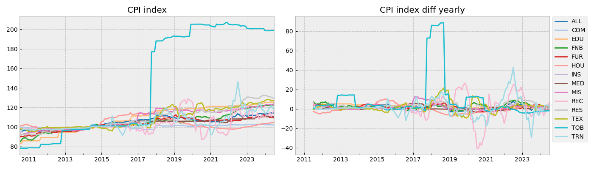

<table border="1" class="dataframe">
  <thead>
    <tr style="text-align: right;">
      <th></th>
      <th>CPI_DIV</th>
      <th>CPI Division</th>
    </tr>
  </thead>
  <tbody>
    <tr>
      <th>0</th>
      <td>TOB</td>
      <td>Tobacco</td>
    </tr>
    <tr>
      <th>1</th>
      <td>MED</td>
      <td>Medical Care</td>
    </tr>
    <tr>
      <th>2</th>
      <td>ALL</td>
      <td>All Items</td>
    </tr>
    <tr>
      <th>3</th>
      <td>FUR</td>
      <td>Furniture and Household Goods</td>
    </tr>
    <tr>
      <th>4</th>
      <td>EDU</td>
      <td>Education</td>
    </tr>
    <tr>
      <th>5</th>
      <td>REC</td>
      <td>Recreation and Culture</td>
    </tr>
    <tr>
      <th>6</th>
      <td>MIS</td>
      <td>Miscellaneous Goods and Services</td>
    </tr>
    <tr>
      <th>7</th>
      <td>COM</td>
      <td>Communications</td>
    </tr>
    <tr>
      <th>8</th>
      <td>FNB</td>
      <td>Food and Beverages</td>
    </tr>
    <tr>
      <th>9</th>
      <td>TEX</td>
      <td>Textiles, Clothing and Footwear</td>
    </tr>
    <tr>
      <th>10</th>
      <td>HOU</td>
      <td>Housing, Water, Electricity, Gas</td>
    </tr>
    <tr>
      <th>11</th>
      <td>RES</td>
      <td>Restaurants and Hotels</td>
    </tr>
    <tr>
      <th>12</th>
      <td>TRN</td>
      <td>Transportation</td>
    </tr>
    <tr>
      <th>13</th>
      <td>INS</td>
      <td>Insurance and Financial Services</td>
    </tr>
  </tbody>
</table>

When integrating this data with real estate figures, we will **apply a one-month data shift**. These attributes will be labeled with the prefix **CPI_**.  

#### AED/USD Exchange Rate (Currency Strength)  

The figure below illustrates the **average monthly value** of the AED/USD currency pair.  
- The exchange rate remains stable at **0.27**.  

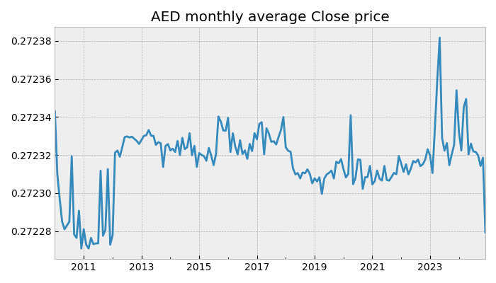

When incorporating this data into real estate analysis, we will **apply a one-month data shift**.  

#### Gross Domestic Product (GDP) Indicators  

The figure below presents the **quarterly GDP index** across different sectors.  
- On the left, absolute values are displayed, while on the right, the **year-over-year percentage changes** are shown.  
- During the **COVID-19 period**, we observe **significant fluctuations**, particularly in:  
  - **Accommodation & Food Service Activities**  
  - **Mining & Quarrying**  
  - **Transportation & Storage**  

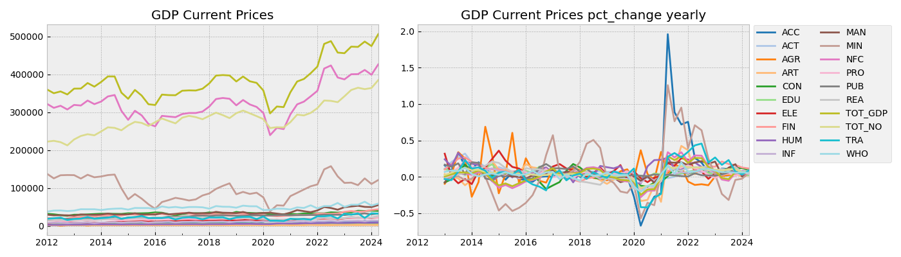

<table border="1" class="dataframe">
  <thead>
    <tr style="text-align: right;">
      <th></th>
      <th>MEASURE</th>
      <th>Measure</th>
    </tr>
  </thead>
  <tbody>
    <tr>
      <th>0</th>
      <td>NFC</td>
      <td>Non-Financial Corporations</td>
    </tr>
    <tr>
      <th>1</th>
      <td>FIN</td>
      <td>Financial and insurance activities</td>
    </tr>
    <tr>
      <th>2</th>
      <td>WHO</td>
      <td>Wholesale and Retail Trade</td>
    </tr>
    <tr>
      <th>3</th>
      <td>MIN</td>
      <td>Mining and Quarrying</td>
    </tr>
    <tr>
      <th>4</th>
      <td>REA</td>
      <td>Real Estate Activities</td>
    </tr>
    <tr>
      <th>5</th>
      <td>CON</td>
      <td>Construction</td>
    </tr>
    <tr>
      <th>6</th>
      <td>PUB</td>
      <td>Public Administration and Defence</td>
    </tr>
    <tr>
      <th>7</th>
      <td>HUM</td>
      <td>Human Health and Social work Activities</td>
    </tr>
    <tr>
      <th>8</th>
      <td>PRO</td>
      <td>Professional Activities</td>
    </tr>
    <tr>
      <th>9</th>
      <td>TOT_GDP</td>
      <td>Gross Domestic Product</td>
    </tr>
    <tr>
      <th>10</th>
      <td>ART</td>
      <td>Arts and Other Service Activities</td>
    </tr>
    <tr>
      <th>11</th>
      <td>MAN</td>
      <td>Manufacturing</td>
    </tr>
    <tr>
      <th>12</th>
      <td>ELE</td>
      <td>Electricity, gas, and Water Supply</td>
    </tr>
    <tr>
      <th>13</th>
      <td>AGR</td>
      <td>Agriculture,Forestry and Fishing</td>
    </tr>
    <tr>
      <th>14</th>
      <td>EDU</td>
      <td>Education</td>
    </tr>
    <tr>
      <th>15</th>
      <td>TOT_NO</td>
      <td>Non-oil Gross Domestic Product</td>
    </tr>
    <tr>
      <th>16</th>
      <td>TRA</td>
      <td>Transportation and Storage</td>
    </tr>
    <tr>
      <th>17</th>
      <td>INF</td>
      <td>Information and Communication</td>
    </tr>
    <tr>
      <th>18</th>
      <td>ACT</td>
      <td>Activities of Households as Employers</td>
    </tr>
    <tr>
      <th>19</th>
      <td>ACC</td>
      <td>Accommodation and Food Service Activities</td>
    </tr>
  </tbody>
</table>

To align this data with real estate figures, we will:  
- Convert quarterly GDP data to a **monthly format** using linear interpolation.  
- Apply a **three-month data shift**.  
- These attributes will be labeled with the prefix **GDP_**.  

#### Population Indicators  

The figure below illustrates the **annual population trends**.  
- On the left, absolute values are presented, while on the right, the **year-over-year percentage changes** are shown.  
- A **sharp decline** in population is observed during the **COVID-19 period**.  
- The male population consistently accounts for approximately **65%** of the total.  

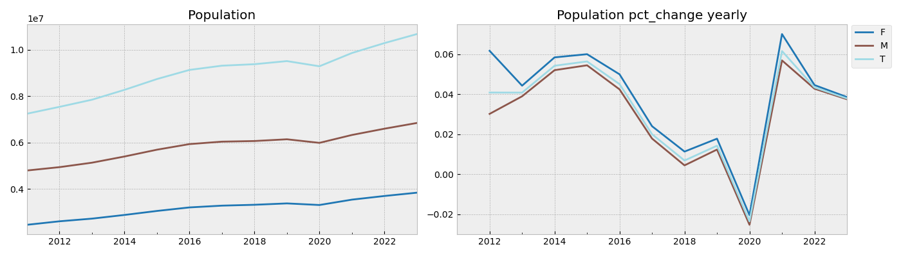

To integrate this data with real estate metrics, we will:  
- Convert annual population data to a **monthly format** using linear interpolation.  
- Apply a **12-month data shift**.  
- These attributes will be labeled with the prefix **POP_**.  

#### Tourism Indicators  

The figure below showcases **annual tourism statistics**.  
- On the left, absolute values are displayed, while on the right, the **year-over-year percentage changes** are shown.

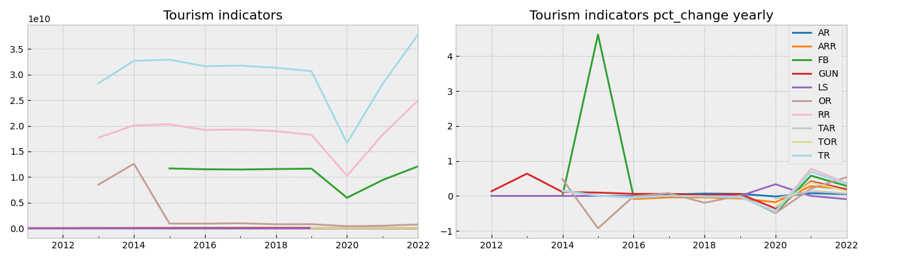

<table border="1" class="dataframe">
  <thead>
    <tr style="text-align: right;">
      <th></th>
      <th>H_INDICATOR</th>
      <th>Hotel Indicator</th>
      <th>UNIT_MEASURE</th>
    </tr>
  </thead>
  <tbody>
    <tr>
      <th>0</th>
      <td>RR</td>
      <td>Room revenue</td>
      <td>AED</td>
    </tr>
    <tr>
      <th>1</th>
      <td>TOR</td>
      <td>Total Occupaied Rooms</td>
      <td>NUMBER</td>
    </tr>
    <tr>
      <th>2</th>
      <td>GUN</td>
      <td>Guest nights</td>
      <td>NUMBER</td>
    </tr>
    <tr>
      <th>3</th>
      <td>LS</td>
      <td>Length of Stay (Avg)</td>
      <td>NUMBER</td>
    </tr>
    <tr>
      <th>4</th>
      <td>FB</td>
      <td>Food and beverage revenue</td>
      <td>AED</td>
    </tr>
    <tr>
      <th>5</th>
      <td>AR</td>
      <td>Rooms (No.)</td>
      <td>NUMBER</td>
    </tr>
    <tr>
      <th>6</th>
      <td>OR</td>
      <td>Other revenue</td>
      <td>AED</td>
    </tr>
    <tr>
      <th>7</th>
      <td>TR</td>
      <td>Total revenue</td>
      <td>AED</td>
    </tr>
    <tr>
      <th>8</th>
      <td>TAR</td>
      <td>Total Available Rooms</td>
      <td>NUMBER</td>
    </tr>
    <tr>
      <th>9</th>
      <td>ARR</td>
      <td>Average room rate (ARR)</td>
      <td>AED</td>
    </tr>
  </tbody>
</table>

For real estate analysis, we will **follow the same methodology as other annual indicators**.  

#### Additional Annual Indicators from the World Bank  

We have also incorporated a comprehensive dataset of **1,496 annual indicators** from the **World Bank**.  
- After filtering out insufficiently populated indicators, **389 key indicators** were retained and added to the main dataset.  
- When integrating these indicators with real estate data, we will **follow the same methodology as other annual indicators**.  
- These attributes will be labeled with the prefix **WB_**.  

## 2. Exploratory Data Analysis

### Sales market

#### Overall statistics  

The figure below presents **monthly data** on transaction volumes, transaction counts, and the **average price per square meter**.  

- We observe **significant growth** in both transaction counts and volumes since **2020**.  
- Over the two-year period from **2020 to 2022**, these metrics have increased by approximately **four times**.  

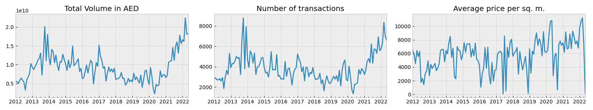

#### Variations by Property Type  

However, the data varies significantly depending on the **type of real estate**. From the graph below, we can see that:  

- **Units** represent the **largest market** in terms of transaction count, yet their total transaction volume is comparable to that of **Land**.  
- The **lowest average price per square meter** is observed in **Land**, followed by **Buildings**, with **Units** having the highest price per square meter.

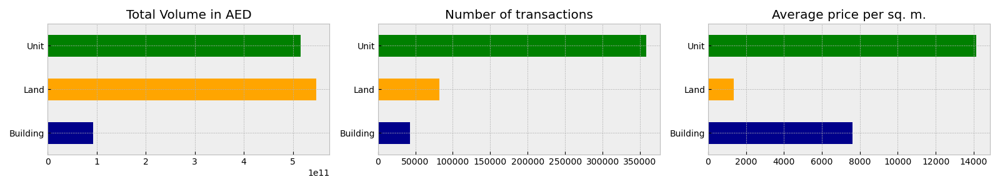

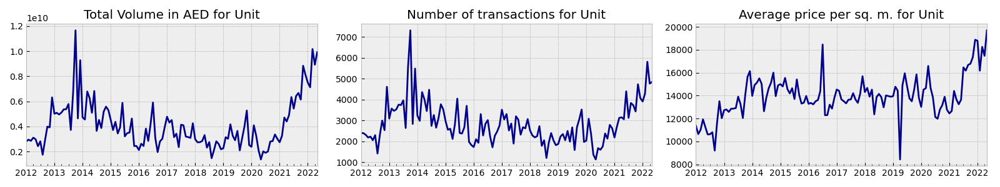

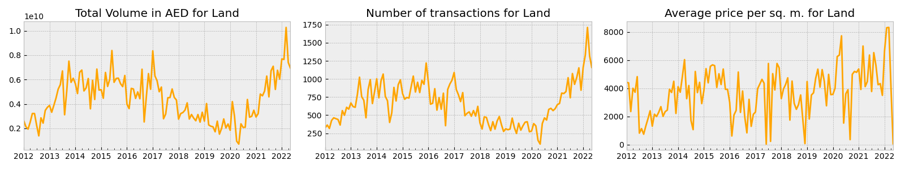

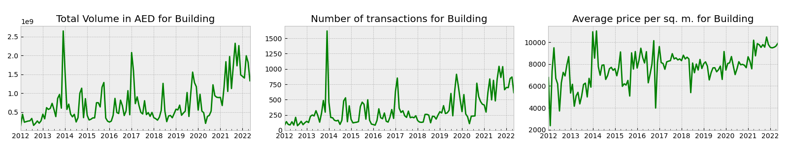

#### Feature Selection & Correlation Analysis  

The dataset of additional attributes is **extensive**, so we will perform **feature selection** by calculating the **correlation coefficient** with the target variable.  

The figure below highlights the **top 20 features** with the **highest correlation** for each **property type**.

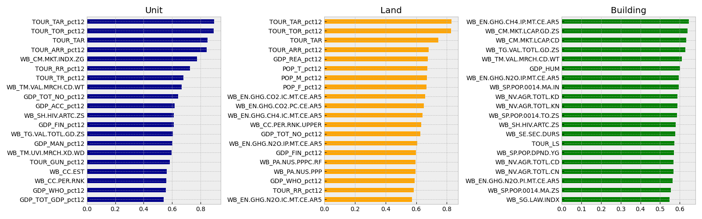

### Rental Market 

#### Overall Statistics 

The figure below presents **monthly data** on transaction volumes, transaction counts, and the **average price per square meter**.  

- Over the past **10 years**, we observe a **steady increase** in key metrics.  
- A **sharp decline** occurred in **2020**, mirroring trends in the broader real estate transaction market.  

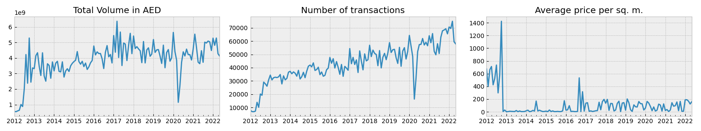

#### **Variations by Property Type**  

However, the data varies significantly depending on the **type of real estate**.  

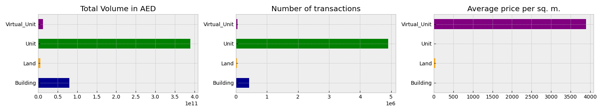

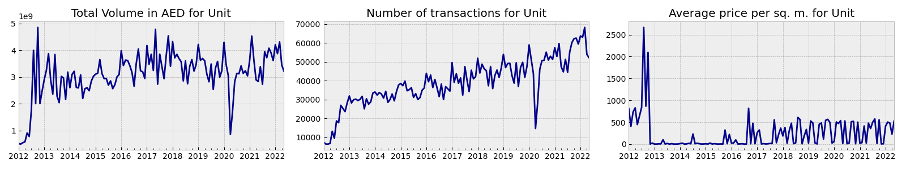

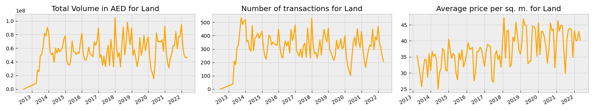

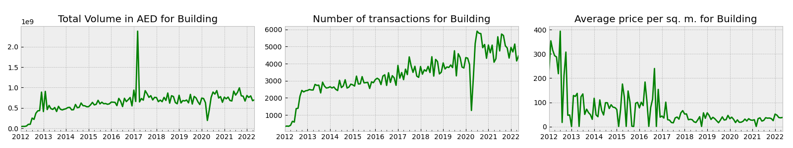

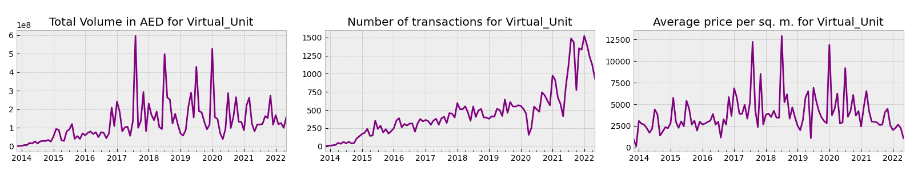

Due to **anomalous values**, the **average price per square meter** does not reflect meaningful trends.  

#### **Feature Selection & Correlation Analysis**  

Given the **large dataset** of additional attributes, we will perform **feature selection** by calculating the **correlation coefficient** with the target variable.  

The figure below highlights the **top 20 features** with the **highest correlation** for each **property type**.  

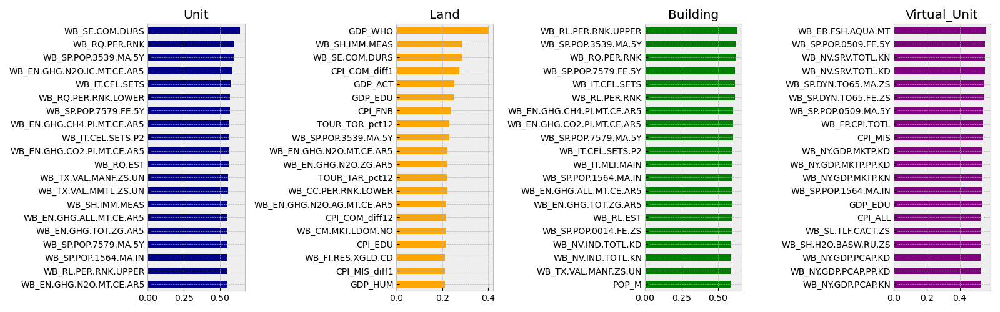

## 3. Modeling

### Sales market

#### Target Analysis 

Let's examine the **distribution of the target variable** that we will be forecasting.  

Due to the presence of **extremely high values**, we decided to **clip** the target into **fixed intervals**.  

The table below presents **summary statistics** for different **property types**.  

##### Defining Target Clipping Boundaries  

To determine appropriate clipping thresholds, we follow these steps:  

- Log Transformation:  
   - We apply a **logarithmic transformation** to the target variable.  
- Statistical Analysis:  
   - We analyze values within the range of **mean ± 3 standard deviations**.  
   - Based on these calculations, we select **well-defined lower and upper bounds**.  
- Impact on Outliers:  
   - As seen from the **lower and upper percentiles**, only a **small number of transactions** fall into the outlier range.  
   - These transactions will be clipped to the **minimum and maximum** values accordingly.  

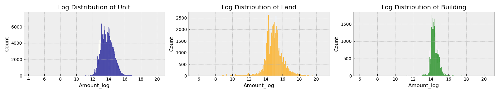

<table border="1" class="dataframe">
  <thead>
    <tr style="text-align: right;">
      <th>Property Type</th>
      <th>Building</th>
      <th>Land</th>
      <th>Unit</th>
    </tr>
  </thead>
  <tbody>
    <tr>
      <th>count</th>
      <td>42,627</td>
      <td>82,344</td>
      <td>358,487</td>
    </tr>
    <tr>
      <th>mean</th>
      <td>2,181,542</td>
      <td>6,646,610</td>
      <td>1,438,908</td>
    </tr>
    <tr>
      <th>std</th>
      <td>5,579,646</td>
      <td>20,978,677</td>
      <td>2,473,631</td>
    </tr>
    <tr>
      <th>min</th>
      <td>400</td>
      <td>251</td>
      <td>68</td>
    </tr>
    <tr>
      <th>0.2%</th>
      <td>319,137</td>
      <td>10,825</td>
      <td>99,508</td>
    </tr>
    <tr>
      <th>50%</th>
      <td>1,750,888</td>
      <td>3,050,000</td>
      <td>977,299</td>
    </tr>
    <tr>
      <th>99.8%</th>
      <td>20,000,000</td>
      <td>189,030,695</td>
      <td>17,800,025</td>
    </tr>
    <tr>
      <th>max</th>
      <td>750,000,000</td>
      <td>1,125,000,000</td>
      <td>575,000,000</td>
    </tr>
    <tr>
      <th>mean-3std</th>
      <td>451,691</td>
      <td>100,292</td>
      <td>96,423</td>
    </tr>
    <tr>
      <th>mean+3std</th>
      <td>7,661,078</td>
      <td>96,384,734</td>
      <td>10,644,605</td>
    </tr>
    <tr>
      <th>lower</th>
      <td>100,000</td>
      <td>100,000</td>
      <td>100,000</td>
    </tr>
    <tr>
      <th>upper</th>
      <td>10,000,000</td>
      <td>100,000,000</td>
      <td>10,000,000</td>
    </tr>
    <tr>
      <th>lower_cnt</th>
      <td>39</td>
      <td>1,028</td>
      <td>718</td>
    </tr>
    <tr>
      <th>upper_cnt</th>
      <td>198</td>
      <td>447</td>
      <td>2,145</td>
    </tr>
  </tbody>
</table>

#### Modeling Approach  

We will develop **separate models** for each **property type**, as our experiments indicate that this approach yields **higher accuracy** compared to a **single model** for all types.  

We will train the models using **Gradient Boosting (XGBoost)** and evaluate performance using the following metrics:  
- **MAE (Mean Absolute Error)**  
- **MAPE (Mean Absolute Percentage Error)**  

##### Model Performance Insights  

- **Overall, we achieved strong model performance across all property types.** except **Land**. 
- The **best results** (in terms of MAPE and MAE) were observed for the **Building** property type.  
- The **lowest performance** was recorded for the **Land** property type.  
- Model accuracy has **significantly improved** in **recent years**, particularly for the **Building** category.

<table border="1" class="dataframe">
  <thead>
    <tr>
      <th></th>
      <th colspan="2" halign="left">MAE</th>
      <th colspan="2" halign="left">MAPE</th>
    </tr>
    <tr>
      <th>Feats</th>
      <th>Initial</th>
      <th>With additional</th>
      <th>Initial</th>
      <th>With additional</th>
    </tr>
    <tr>
      <th>Property Type</th>
      <th></th>
      <th></th>
      <th></th>
      <th></th>
    </tr>
  </thead>
  <tbody>
    <tr>
      <th>Building</th>
      <td>170,716.39</td>
      <td>168,324.85</td>
      <td>10.65</td>
      <td>10.76</td>
    </tr>
    <tr>
      <th>Land</th>
      <td>2,041,145.59</td>
      <td>2,034,784.49</td>
      <td>45.04</td>
      <td>43.40</td>
    </tr>
    <tr>
      <th>Unit</th>
      <td>178,319.93</td>
      <td>175,984.26</td>
      <td>14.08</td>
      <td>13.85</td>
    </tr>
  </tbody>
</table>

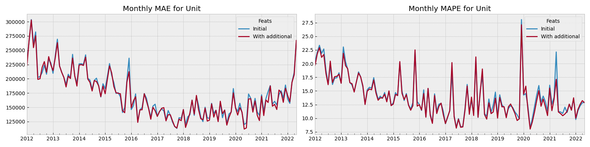

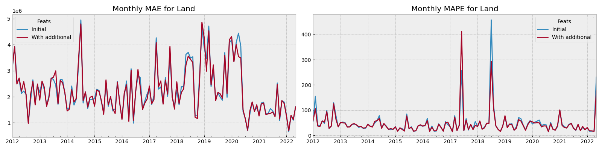

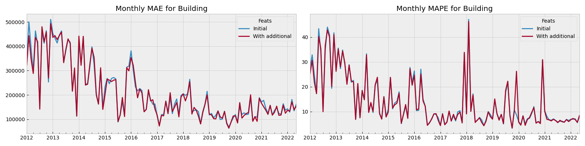

### Rental market

#### Target Analysis 

Let's examine the **distribution of the target variable** that we will be forecasting.  

Due to the presence of **extremely high values**, we decided to **clip** the target into **fixed intervals**.  

The table below presents **summary statistics** for different **property types**.  

##### Defining Target Clipping Boundaries  

To determine appropriate clipping thresholds, we follow these steps:  

- Log Transformation:  
   - We apply a **logarithmic transformation** to the target variable.  
- Statistical Analysis:  
   - We analyze values within the range of **mean ± 3 standard deviations**.  
   - Based on these calculations, we select **well-defined lower and upper bounds**.  
- Impact on Outliers:  
   - As seen from the **lower and upper percentiles**, only a **small number of transactions** fall into the outlier range.  
   - These transactions will be clipped to the **minimum and maximum** values accordingly.  

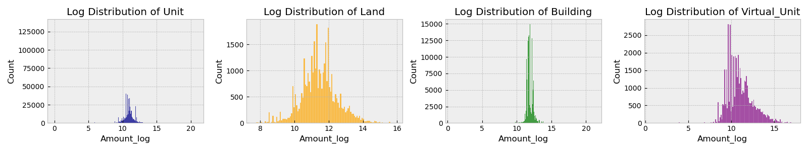

<table border="1" class="dataframe">
  <thead>
    <tr style="text-align: right;">
      <th>Property Type</th>
      <th>Building</th>
      <th>Land</th>
      <th>Unit</th>
      <th>Virtual_Unit</th>
    </tr>
  </thead>
  <tbody>
    <tr>
      <th>count</th>
      <td>421,395</td>
      <td>36,097</td>
      <td>4,904,728</td>
      <td>47,306</td>
    </tr>
    <tr>
      <th>mean</th>
      <td>188,953</td>
      <td>175,261</td>
      <td>79,367</td>
      <td>276,529</td>
    </tr>
    <tr>
      <th>std</th>
      <td>2,738,228</td>
      <td>335,550</td>
      <td>1,400,668</td>
      <td>1,111,630</td>
    </tr>
    <tr>
      <th>min</th>
      <td>1</td>
      <td>2,000</td>
      <td>0</td>
      <td>1</td>
    </tr>
    <tr>
      <th>0.2%</th>
      <td>13,200</td>
      <td>4,000</td>
      <td>113</td>
      <td>2,400</td>
    </tr>
    <tr>
      <th>50%</th>
      <td>150,000</td>
      <td>90,035</td>
      <td>52,000</td>
      <td>48,000</td>
    </tr>
    <tr>
      <th>99.8%</th>
      <td>3,007,434</td>
      <td>3,109,842</td>
      <td>1,295,072</td>
      <td>12,576,374</td>
    </tr>
    <tr>
      <th>max</th>
      <td>1,610,378,071</td>
      <td>8,000,000</td>
      <td>1,116,000,000</td>
      <td>30,356,872</td>
    </tr>
    <tr>
      <th>mean-3std</th>
      <td>26,045</td>
      <td>3,955</td>
      <td>4,257</td>
      <td>692</td>
    </tr>
    <tr>
      <th>mean+3std</th>
      <td>828,682</td>
      <td>2,248,094</td>
      <td>640,390</td>
      <td>5,448,659</td>
    </tr>
    <tr>
      <th>lower</th>
      <td>10,000</td>
      <td>1,000</td>
      <td>1,000</td>
      <td>1,000</td>
    </tr>
    <tr>
      <th>upper</th>
      <td>1,000,000</td>
      <td>2,000,000</td>
      <td>1,000,000</td>
      <td>1,000,000</td>
    </tr>
    <tr>
      <th>lower_cnt</th>
      <td>417</td>
      <td>0</td>
      <td>20,429</td>
      <td>46</td>
    </tr>
    <tr>
      <th>upper_cnt</th>
      <td>2,265</td>
      <td>204</td>
      <td>14,218</td>
      <td>2,545</td>
    </tr>
  </tbody>
</table>

#### Modeling Approach  

We will develop **separate models** for each **property type**, as our experiments indicate that this approach yields **higher accuracy** compared to a **single model** for all types.  

We will train the models using **Gradient Boosting (XGBoost)** and evaluate performance using the following metrics:  
- **MAE (Mean Absolute Error)**  
- **MAPE (Mean Absolute Percentage Error)**  

##### Model Performance Insights  

- **Overall, we achieved strong model performance across all property types.** except **Virtual_Unit**. 
- The **best results** (in terms of MAPE and MAE) were observed for the **Land** property type.  
- The **lowest performance** was recorded for the **Virtual_Unit** property type.  
- Model accuracy has **significantly improved** in **recent years**.

<table border="1" class="dataframe">
  <thead>
    <tr>
      <th></th>
      <th colspan="2" halign="left">MAE</th>
      <th colspan="2" halign="left">MAPE</th>
    </tr>
    <tr>
      <th>Feats</th>
      <th>Initial</th>
      <th>With additional</th>
      <th>Initial</th>
      <th>With additional</th>
    </tr>
    <tr>
      <th>Property Type</th>
      <th></th>
      <th></th>
      <th></th>
      <th></th>
    </tr>
  </thead>
  <tbody>
    <tr>
      <th>Building</th>
      <td>20,441.50</td>
      <td>20,395.86</td>
      <td>15.25</td>
      <td>15.23</td>
    </tr>
    <tr>
      <th>Land</th>
      <td>14,031.49</td>
      <td>13,504.47</td>
      <td>9.73</td>
      <td>9.86</td>
    </tr>
    <tr>
      <th>Unit</th>
      <td>13,066.90</td>
      <td>13,048.80</td>
      <td>25.44</td>
      <td>25.06</td>
    </tr>
    <tr>
      <th>Virtual_Unit</th>
      <td>30,411.23</td>
      <td>29,239.37</td>
      <td>41.64</td>
      <td>42.65</td>
    </tr>
  </tbody>
</table>

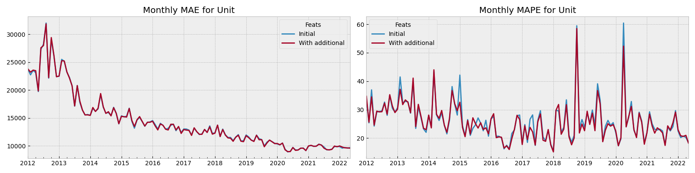

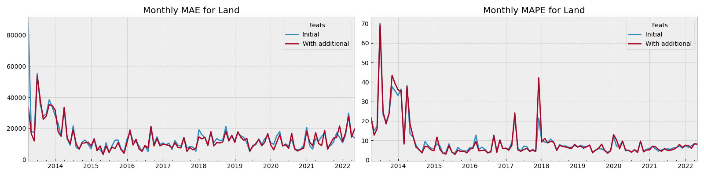

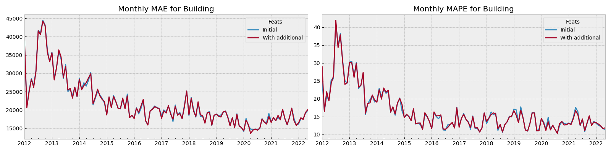

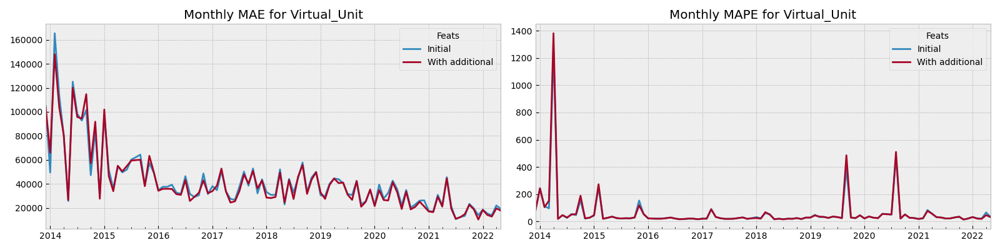

## 4. Bonus and recommendations

### **Forecasting & Analysis**  

We will take **all transactions from the past six months** and generate **predictions** using our models.  

To analyze performance, we will:  
- **Divide both predictions and actual values into 10 evenly distributed buckets**.  
- Construct a **matrix comparing predicted vs. actual values**.  

### **Interpreting the Results**  

- If a **prediction is high**, but the **actual value is low**, this could indicate:  
  - A **model error** in overestimating the property’s value.  
  - A **potentially lucrative deal** that warrants further investigation.  
- Therefore, a **detailed review** of such properties is necessary.  

### **Methodology & Use Case**  

- This approach is useful for **sorting and identifying promising candidates**.  
- However, it requires **additional analysis** to confirm opportunities.  
- Below, we present the **top listings for each property type** based on our predictions.  

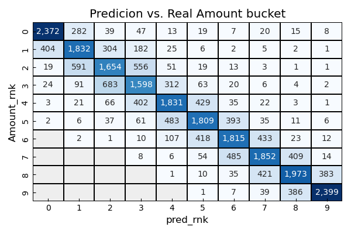

<table border="1" class="dataframe">
  <thead>
    <tr style="text-align: right;">
      <th></th>
      <th>Property ID</th>
      <th>Amount</th>
      <th>dt_month</th>
      <th>pred</th>
      <th>Amount_rnk</th>
      <th>pred_rnk</th>
    </tr>
    <tr>
      <th>Property Type</th>
      <th></th>
      <th></th>
      <th></th>
      <th></th>
      <th></th>
      <th></th>
    </tr>
  </thead>
  <tbody>
    <tr>
      <th>Building</th>
      <td>859514334</td>
      <td>100,000.00</td>
      <td>2022-03-01</td>
      <td>8,210,458.25</td>
      <td>0</td>
      <td>9</td>
    </tr>
    <tr>
      <th>Land</th>
      <td>1253380035</td>
      <td>142,707.68</td>
      <td>2022-05-01</td>
      <td>7,679,044.50</td>
      <td>0</td>
      <td>8</td>
    </tr>
    <tr>
      <th>Unit</th>
      <td>276319953</td>
      <td>500,000.00</td>
      <td>2022-05-01</td>
      <td>2,960,526.30</td>
      <td>1</td>
      <td>8</td>
    </tr>
  </tbody>
</table>

### Output 

We have analyzed the property rental and sales markets of Dubai for the period from 2012 to 2022. These markets are very similar in terms of features impacting the rental/transactional price of properties, but there are some important differences that we can highlight:  

1. The rental market has been **constantly growing** since 2012 for all property types except **Land**, whereas the **sales market** started actively growing from the **second quarter of 2020** (coinciding with the start of COVID-19).  
2. **Annual rental prices have been declining since 2017**, when they peaked, while **sales property prices have been increasing**.  
3. **Models for predicting sales prices perform better** in terms of accuracy compared to models for predicting annual rental amounts.  
4. **Additional attributes provided only a slight improvement** in model quality across both markets.  
5. The developed **model can be used to identify potentially attractive real estate**, helping to **detect undervalued properties** and support **data-driven investment decisions**.  
